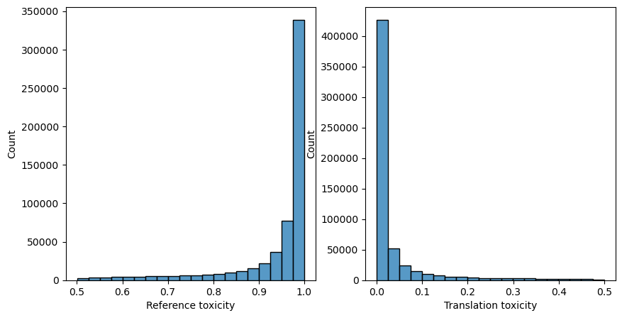
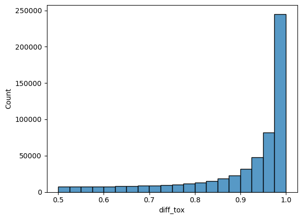
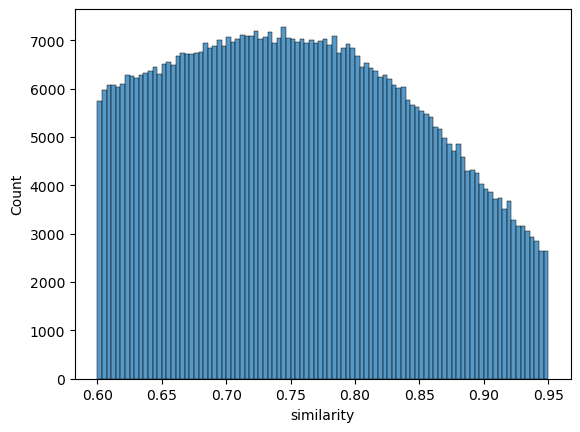
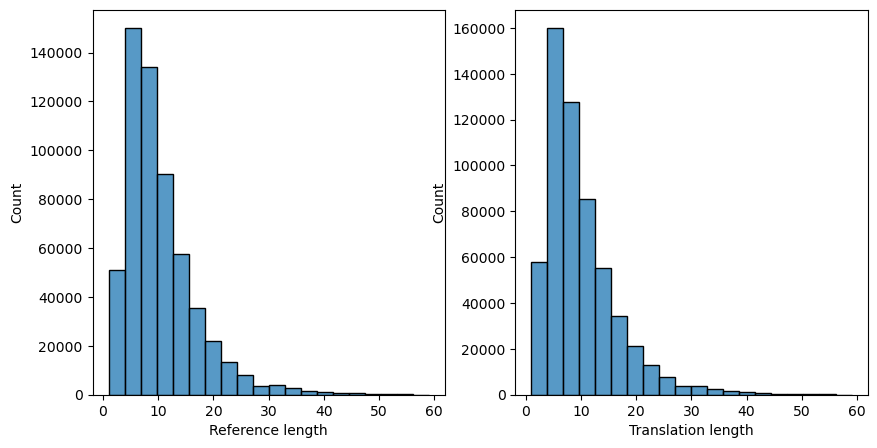

# Text detoxification solution

# Data Preparation
Original data contains pairs of texts (original and paraphrased), levels of their toxicities and their cosine similarities. However, the toxic and detoxified sentences were mixed between two columns (reference and translated). So, it needed to be switched. 

Since the one of the models I chose took as input maximum 128 words, I dropped the data exeeding this limit. Luckily, such rows are less than 1% of the whole dataset so we don`t lose much information.
# Data analysis
Here are some plots to see the distribution of the preprocessed data.

Toxicity levels of texts



Difference in toxicity levels between reference and paraphrased ones



Cosine similarities of text pairs. We can see that they all are above 60%.



Number of words in texts


# Model Specification
Parahrasing model: ```humarin/chatgpt_paraphraser_on_T5_base``` ([link](https://huggingface.co/humarin/chatgpt_paraphraser_on_T5_base?text=When+should+I+go+to+the+doctor%3F))

Toxicity classifier model: ```SkolkovoInstitute/roberta_toxicity_classifier``` ([link](https://huggingface.co/s-nlp/roberta_toxicity_classifier?text=Some+weights+of+the+model+checkpoint+at++fuck))

Context similarity model: ```sentence-transformers/all-MiniLM-L6-v2``` ([link](https://huggingface.co/sentence-transformers/all-MiniLM-L6-v2)).

The detoxification framework is based on the following algorithm:

* Firstly, paraphrasing model generates specified number of paraphrased texts (e.g. 10).

* For each of the generated texts, toxicity and cosine similarity with the original prompt are calculated.

* Text with the highest average of two metrics is chosen.


# Training Process
Training of the paraphrasing model was with the usage of Low Rank Adaptation (LoRA) optimization technique. I used only subset of the original data to make the training process faster.
Parameters for the training
```
    learning_rate =      2e-5
    batch_size =         16
    weight_decay =       0.01
    num_train_epochs =   3
    fp16 =               True
    dataset_subset =     0.15
```
Parameters for the LoRA
```
    r =                  16,
    lora_alpha =         32
    target_modules =     ["q", "v"]
    lora_dropout =       0.05
    bias =               "none"
    task_type =          "SEQ_2_SEQ_LM"
```
# Evaluation
For the evaluation, 3 metrics were used:
* Average toxicity level obtained from toxicity classifier model
* Average cosine similarity computed from the embeddings obtained by similarity model
* SacreBLEU score commonly used for translation / paraphrasing tasks

# Results

Here are the metrics for the different iterations of the model:

### Baseline
Metrics obtained from the reference and translation columns of the original dataset. No model applied.

* toxicity: 0.09911557480319434
* cosine similarity: 0.6993823647499084, 
* bleu: 22.748979964592944

### Stock model

* toxicity: 0.3095971209607241
* cosine similarity: 0.716109037399292, 
* bleu: 19.189722333388502

### Fine-tuned model

* toxicity: 0.5143966753414774
* cosine similarity: 0.9037672281265259, 
* bleu: 57.85035243169158

### Chain of models

* toxicity: 0.1021561338604425
* cosine similarity: 0.8369008626516601, 
* bleu: 45.38861440755535

# Possible improvements
* One can train the model more and on the whole dataset
* Toxicity classifier can be trained to match the dataset toxicity distribution
* Change the way the chain of models chooses the best shot (e.g. weighted average or rank-based decision)